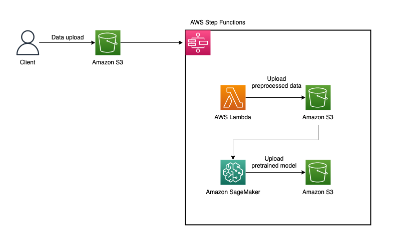
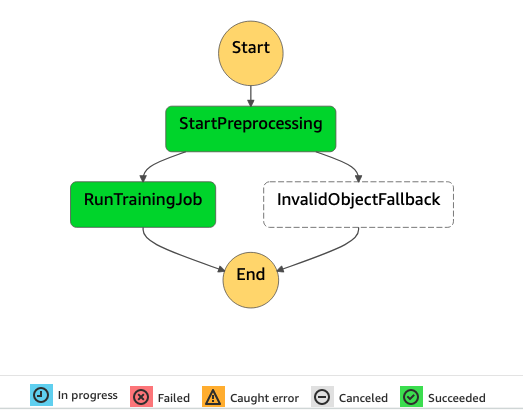
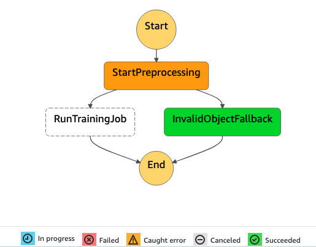

# Step Functions + SageMaker ML Pipeline



ML pipeline with AWS Step Functions and Amazon SageMaker to train Japanese language model using BlazingText algorithm ( optimized implementations of the Word2vec).

## Requirements

- AWS Account
- AWS Region: us-east-1
- AWS SAM CLI (1.66.0)
- Docker (20.10.7)

## Usage

### Setup
Run the following command:

```shell
$ sam build && sam deploy --guided

Configuring SAM deploy
======================

        Looking for config file [samconfig.toml] :  Not found

        Setting default arguments for 'sam deploy'
        =========================================
        Stack Name [sam-app]: ml-pipeline
        AWS Region [us-east-1]: us-east-1
        #Shows you resources changes to be deployed and require a 'Y' to initiate deploy
        Confirm changes before deploy [y/N]: y
        #SAM needs permission to be able to create roles to connect to the resources in your template
        Allow SAM CLI IAM role creation [Y/n]: y
        #Preserves the state of previously provisioned resources when an operation fails
        Disable rollback [y/N]: y
        Save arguments to configuration file [Y/n]: y
        SAM configuration file [samconfig.toml]: 
        SAM configuration environment [default]: 

        Looking for resources needed for deployment:
         Managed S3 bucket: aws-sam-cli-managed-default-samclisourcebucket-152bxv9ooazzn
         A different default S3 bucket can be set in samconfig.toml
         Image repositories: Not found.
         #Managed repositories will be deleted when their functions are removed from the template and deployed
         Create managed ECR repositories for all functions? [Y/n]: y

Previewing CloudFormation changeset before deployment
======================================================
Deploy this changeset? [y/N]: y 

Outputs                                                                                         
-------------------------------------------------------------------------------------------------
Key                 DatasetSourceBucket                                                         
Description         -                                                                           
Value               ml-pipeline-sourcebucket-ymlpqzynkk4k                                       
```

### Pipeline execution (valid input)
Upload `tests/data/valid.csv` to `<DataSourceBucket>`. State machine execution begins, Lambda preprocesses the input csv file, SageMaker training job begins and completes training. Pretrained model is uploaded to S3 bucket.



### Pipeline execution (invalid input)
Upload `tests/data/invalid_star.csv` to `<DataSourceBucket>`. State machine execution begins, Lambda preprocesses the input csv file and the Lambda function fails because it assumes the `star_rating` column to be int64 but it contains string in `invalid_star.csv`.


## Clean up
Before deleting the CloudFormation stack, you must delete all objects in S3 buckets.

After deleting all objects, run the following command. Press `y` when asked something.

```shell
$ sam delete

        Are you sure you want to delete the stack ml-pipeline in the region us-east-1 ? [y/N]: y
        Are you sure you want to delete the folder ml-pipeline in S3 which contains the artifacts? [y/N]: y
        Found ECR Companion Stack ml-pipeline-20a352e2-CompanionStack
        Do you you want to delete the ECR companion stack ml-pipeline-20a352e2-CompanionStack in the region us-east-1 ? [y/N]: y
        ECR repository mlpipeline20a352e2/preprocessingfunction6d412513repo may not be empty. Do you want to delete the repository and all the images in it ? [y/N]: y
```